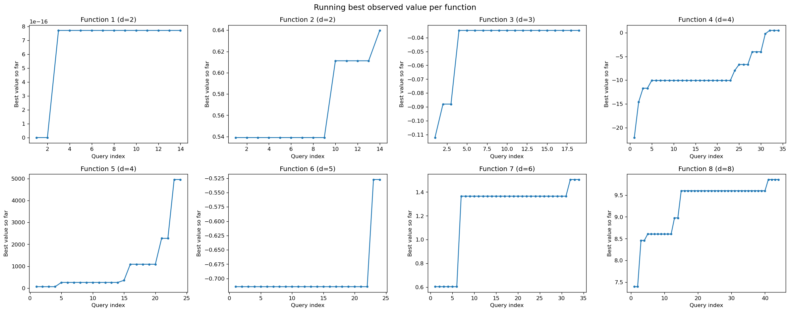

# Bayesian Black-Box Optimisation (BBO) Capstone


## NON-TECHNICAL EXPLANATION OF YOUR PROJECT

This project tackles eight hidden mathematical functions, each standing in
for a real-world problem like finding a radiation source or tuning a
chemical process, where only one test is allowed per function each week.
Rather than guessing randomly, a statistical model learns from every past
result to predict where the best answer is likely to be, and each new
guess is chosen to balance testing promising areas against exploring the
unknown. Over 13 weeks of real feedback, six of the eight functions
improved substantially, in one case more than tripling, while a
mid-project check caught and fixed a bug that would have wasted a test.


## DATA

Eight independent synthetic "black-box" functions, dimensionality 2D to
8D, each provided by the course instructors with 10-40 initial points and
growing by one new (input, output) pair per function per week across 13
rounds of real portal feedback (final sizes: 23-53 points per function).
Every input lies in `[0.000000, 0.999999]`; several real-world analogies
are naturally minimisation problems and their outputs were pre-negated so
higher is always better within this project. Full provenance, structure
and per-function detail: [docs/DATASHEET.md](docs/DATASHEET.md). Raw data
lives in `data/initial_data/function_{1-8}/` as NumPy arrays, not hosted
elsewhere, it's small enough (a few KB per function) to keep directly in
the repository.


## MODEL

A Gaussian Process (GP) regression surrogate, one independently fit per
function, paired with an Upper Confidence Bound (UCB) acquisition
function, implemented from scratch with scikit-learn rather than a
dedicated Bayesian optimisation library. A GP was chosen over a simpler
regression or an SVM because it gives a calibrated uncertainty estimate at
every candidate point, not just a prediction, which UCB needs directly to
balance exploring uncertain regions against exploiting known-good ones.
scikit-learn's exact, CPU-based implementation was chosen over GPU-oriented
alternatives (GPyTorch, BoTorch) because every function has at most a few
dozen points, well within the range where the simpler, more transparent
implementation is sufficient. Full model details, relevant research (the
NeurIPS 2020 winning HEBO approach) and trade-offs:
[docs/MODEL_CARD.md](docs/MODEL_CARD.md) and
[docs/METHODOLOGY.md](docs/METHODOLOGY.md).


## HYPERPARAMETER OPTIMISATION

The GP's own kernel hyperparameters (per-dimension length-scale, noise
level) are optimised automatically every time a model is refit, via
gradient-based restarts (`n_restarts_optimizer=5`) on the marginal
likelihood, no manual search involved. The acquisition function's
exploration weight (`kappa = 2.0`) and the candidate-pool sizes (20,000
random plus 2,000 local) were chosen manually and held fixed across all
eight functions and all 13 rounds, a deliberate simplification given the
small data scale and lack of a validation loop to search against; this is
documented as a known limitation, a function-specific or annealed kappa
would likely be more efficient given how differently the eight functions
behaved.


## RESULTS

Final best value achieved per function across 13 rounds of real feedback
(full per-round narrative in the "Technical approach" log below):

| Function | Best value | Achieved | Improvement from round 1 |
|---|---|---|---|
| 1 | 0.000000 | round 6 | none (stayed at noise floor) |
| 2 | 0.659839 | round 10 | +294% |
| 3 | -0.029742 | round 11 | broke a 10-round stall |
| 4 | 0.655593 | round 12 | improved from negative |
| 5 | 8662.405001 | round 6 | +281% |
| 6 | -0.176172 | round 9 | improved from -0.887 |
| 7 | 2.731447 | round 13 (final) | +132% |
| 8 | 9.993834 | round 12 | +1.4% (near-ceiling from round 1) |

Six of eight functions improved substantially over their starting point.
Function 3 stayed stuck at the instructor-provided initial data's value for
ten straight rounds before finally breaking through in round 11. Function 1
never developed usable signal above noise across the entire project,
consistent with its documented sparse, spike-only behaviour. Full
convergence curves for all eight functions:




## Repository structure

```
notebooks/bbo_capstone.ipynb   Main notebook: fits a GP surrogate per function,
                                proposes the next query, and plots progress.
data/initial_data/             Per-function input/output arrays, final state
                                after 13 rounds of real query results.
docs/DATASHEET.md              Data documentation (component 25.3 template).
docs/MODEL_CARD.md             Model documentation (component 25.3 template).
docs/METHODOLOGY.md            Technical justification, relevant research, library choices.
```

## How to run

```
pip install numpy scikit-learn scipy matplotlib jupyter
jupyter nbconvert --to notebook --execute --inplace notebooks/bbo_capstone.ipynb
```

The notebook reloads whatever data currently exists under `data/initial_data/`,
so re-running it reproduces the final results and convergence plot with no
code changes needed. The optimisation phase is complete (13 of 13 rounds
submitted), so no further query proposals are expected from a fresh run.

## Technical approach: full round-by-round log

- **Rounds 1-2:** established the baseline GP+UCB loop. Function 5 already
  showed the exploration budget paying off, dipping from 2271.5 to 1261.8
  between rounds before jumping to a new best.
- **Rounds 3-4:** confirmed the pattern. Function 5 jumped again to 4956.2 in
  round 3, the largest single-round gain seen so far, while Function 1
  continued showing almost no usable signal (near-zero output across nearly
  all queries), consistent with its documented "sparse spike" behaviour in
  `docs/DATASHEET.md`.
- **Round 5:** re-fit on the full accumulated dataset (14-44 points per
  function depending on dimensionality). Several functions (2, 3, 4, 6) still
  carry wide predicted uncertainty relative to their predicted mean, so
  current proposals lean exploratory rather than confidently exploitative.
- **Round 5 results:** Function 5 jumped again, from 4039.6 to 8297.1, more
  than doubling and easily the largest single-round gain so far. Functions 7
  and 8 both reached new bests (1.74 and 9.96 respectively). Function 1
  remains essentially flat at zero, consistent with its documented sparse,
  spike-only signal.
- **Round 6 results:** a mixed round. Functions 4 and 5 both reached new
  bests (0.619 and 8662.4 respectively, Function 5's fourth consecutive
  improvement), while Functions 6, 7 and 8 came in below their current best,
  expected behaviour under UCB, which deliberately spends some queries on
  exploration rather than pure exploitation.
- **Round 7 results:** Functions 6 and 7 both reached new bests (-0.397 and
  2.235 respectively). Function 5 returned the exact same value as round 6
  (8662.4), since both rounds proposed the identical point, confirming the
  function is deterministic (no observation noise) at that location.
- **Round 8 results:** Function 7 reached another new best (2.273), while
  Functions 5, 6 and 8 came in below their current bests, another
  exploration-heavy round under UCB rather than a regression in the
  underlying model.
- **Round 9 results:** Functions 6 and 7 both reached new bests (-0.176 and
  2.501 respectively). A deep diagnostic pass ahead of round 10 caught a real
  bug: the raw UCB proposal for Function 5 was an exact duplicate of the
  point already queried in rounds 6 and 7 (distance to nearest observation =
  0.0000), which would have wasted a query on a confirmed-deterministic
  function. Fixed by excluding near-duplicate candidates
  (`propose_next_point` now filters out any candidate within 0.02 of an
  already-observed point) before maximising UCB, this also corrected a
  near-duplicate proposal for Function 2.
- **Round 10 results:** Functions 2 and 8 reached new bests (0.660 and
  9.971 respectively). Function 5 came in second-best (8266.8, below the
  8662.4 tied best from rounds 6-7), confirming the true optimum along that
  dimension sits slightly off the exact search boundary rather than exactly
  on it.
- **Round 11 results:** a strong round. Function 3 finally beat the
  instructor-provided initial data for the first time in eleven rounds
  (-0.0297, versus -0.0348 that had stood since before round 1). Functions 4
  and 8 also reached new bests (0.6506 and 9.9761 respectively).
- **Round 12 results:** Functions 4, 7 and 8 all reached new bests (0.6556,
  2.6747 and 9.9938 respectively), the strongest simultaneous-improvement
  round of the whole project. Round 13 is the final round of query
  submissions for the capstone.
- **Round 13 (final) results:** Function 7 improved once more, a fitting
  final-round win (2.7314, up from 2.6747). This was the last submitted
  round, the optimisation phase is now complete.

## Course reference material

`course-reference/` holds supplementary, unrelated course materials (kept
separate from the capstone project itself); see
[course-reference/README.md](course-reference/README.md) for details.
